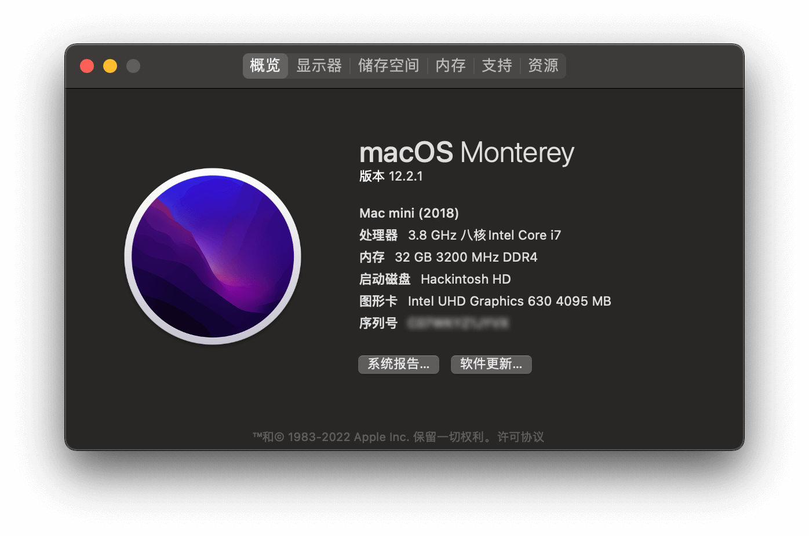
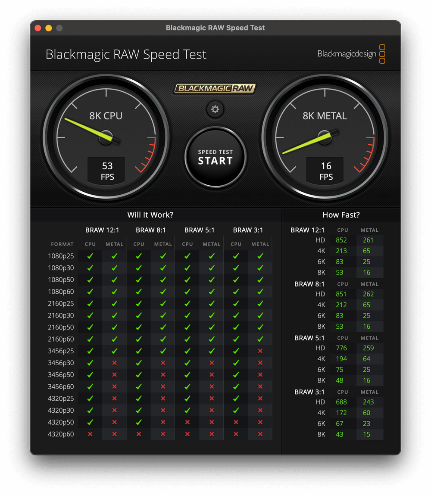
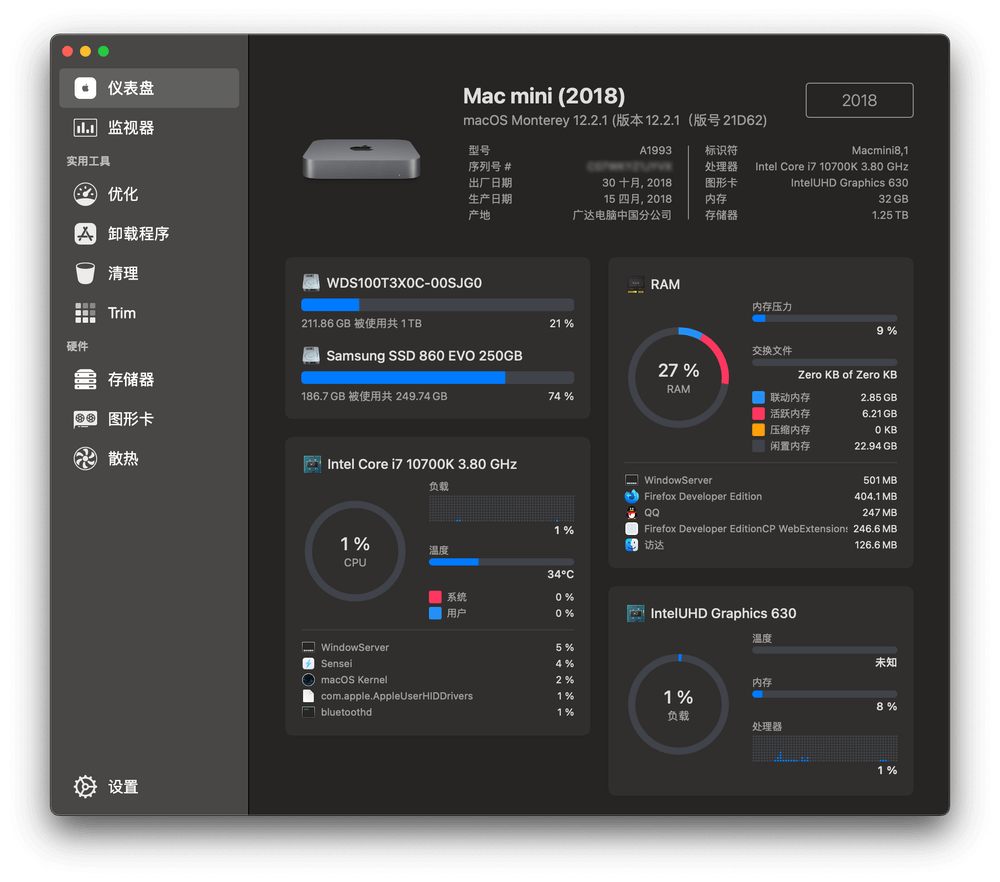
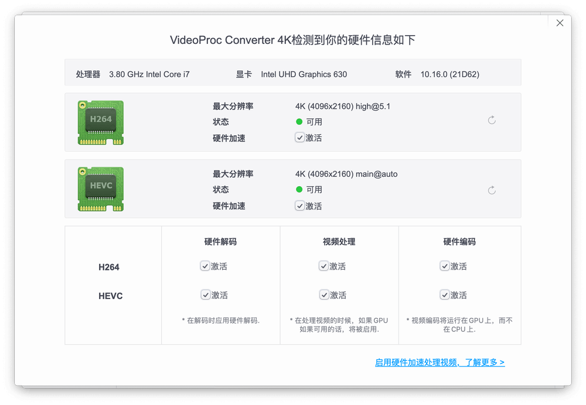
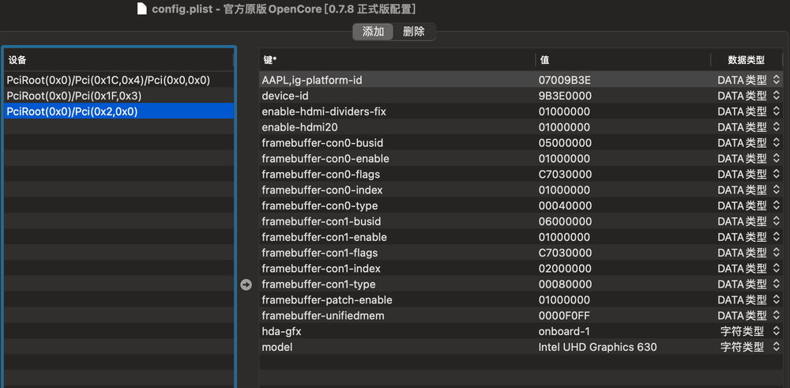
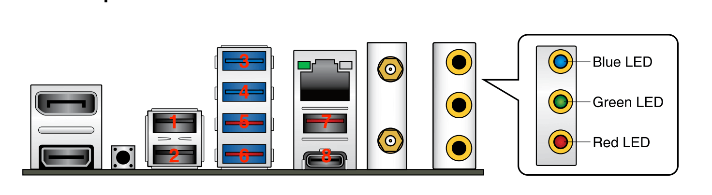
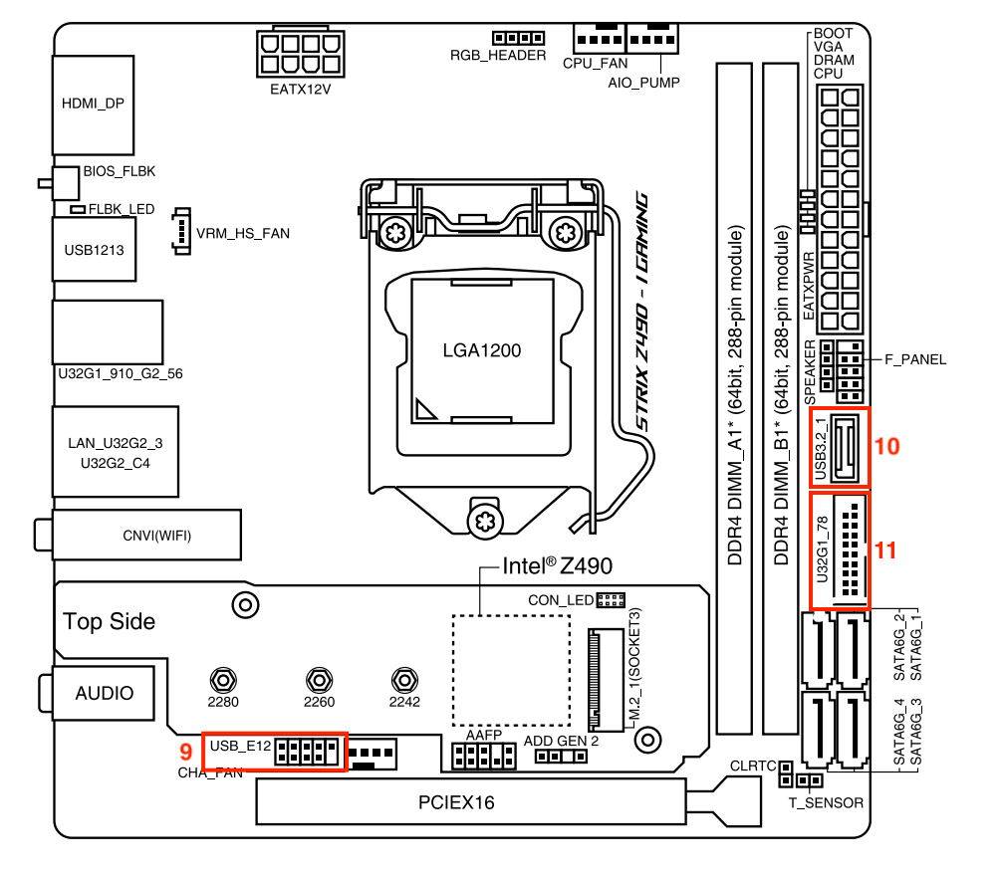
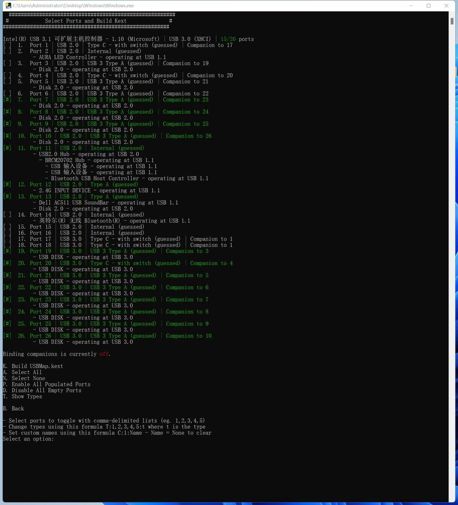

## Hackintosh-ROG-STRIX-Z490I-iGPU

用于 华硕 ROG Strix Z490I Gaming 主板和 Intel 十代 CPU （Comet Labke）参与的核显方案。

⚠️ 不熟悉的朋友，请先熟读 [OpenCore Install Guide](https://dortania.github.io/OpenCore-Install-Guide/) 然后再动手。

## 老规矩先上图





## 硬件配置

| 项目 | 型号 | 说明 |
| :------:| :------| :------|
|  机箱/电源  | 迎广肖邦PRO / 200W | PRO版本自带200瓦电源 |
|  主 板  | 华硕 ROG STRIX Z490-I Gaming | ITX主板，带WIFI|
|   | Intel I225-V 2.5Gbit|2.5G网卡，主板自带 |
|  | Intel AX201NGW | 主板自带无线网卡，CNVI通道，不完美驱动，无法更换。华硕只有 B460-I 可以更换无线网卡 |
|  | BCM94360CS2+M.2转接卡 | 免驱无线网卡，走M.2接口的PCIE通道，完美免驱动。 |
|  | Realtek ALCS1220A | 主板自带声卡 |
|CPU|Intel i7-10700K|从ITX主板的性能入手，这块板子用i9浪费|
|核显|Intel UHD 630 | 核显驱动 |
|内存|芝奇皇家戟 DDR4 3200 32GB (16G×2)|前朝遗物，够用。建议上3600 ~ 4000Ghz的条子，多了没啥加成；<br>土豪请无视此规则。|
|显示器1|DELL U2720Q |支持4K@60.00Hz，DP线连接|
|显示器2|杂牌显示器1080P |HDMI线连接|
|CPU散热| 利民 AXP90-X47 | 此机箱合适的散热高度。 |
| NVME | 西数 SN750 1	T| 黑苹果西数的稳定 |


## 软件配置

* 引导: OpenCore 0.7.8
* 黑果系统: macOS Monterey 12.2.1 (Macmini8,1)


## 工作情况
| 项目 | 情况 | 说明 |
| :------| :------:| :------|
| 声卡 Realtek ALCS1220A |✅| AppleALC完美驱动 |
| 核显 UHD630 |✅| 完美驱动，支持双屏输出 |
| 有限网卡 Intel I225-V 2.5Gb |✅| OC中配置好，即完美可用。 |
| 板载无线 Intel AX201NGW |⚠️| WIFI可用，Inter蓝牙驱动还是有问题。 
| M.2免驱无线 BCM94360CS2 |✅| WIFI、蓝牙、随行、隔空投送等，都完美运行 |
| USB |✅| macOS 12.2.1 必须定制，定制后完美。 |
| 电源管理 |✅| 原生电源管理 |


## 具体详情

### 显卡

#### 核显 Intel UHD 630

手动配置参数，支持 DP/HDMI 双显示器输出。 

配置参数:

* ig-platform-id = `07009B3E`




### 声卡

配置参数:

* 必要驱动 ：AppleALC.kext
* layout-id = 7

DeviceProperties: 

```xml
<key>PciRoot(0x0)/Pci(0x1f,0x3)</key>
<dict>
    <key>layout-id</key>
    <integer>7</integer>
</dict>
```

### 有线网卡 Intel I225-V 2.5Gb 

配置参数:

* device-id=`F2150000`

DeviceProperties: 

```xml
<key>PciRoot(0x0)/Pci(0x1C,0x4)/Pci(0x0,0x0)</key>
<dict>
    <key>device-id</key>
    <data>8hUAAA==</data>
</dict>
```

启动参数中添加：

```
dk.e1000=0
```


### 无线网卡和蓝牙

板载无线网卡是 Intel AX201 NGW，接口是 M.2 E-Key ，并且使用的是兼容 CNVi 协议的 PCIE 通道。已经有大神尝试更换了一个 M.2 A-Key 接口的 BCM94352Z 免驱网卡, 虽然插槽是兼容的，但是网卡在Windows中也不起作用。所以大神让大家不用尝试更换网卡了。 

免驱无线网卡使用的是 BCM94360CS2 ，利用 M.2接口的转接卡，可以安装在靠近主板的一侧的M.2接口上。


### USB定制

这边我给大家看下我的定制方案。

机箱是先马趣造，有2个USB 3.0 前置，没有前置的USB-TYPE-C。
我是在Windows下定制的，感觉比较简单，可以随意处理同一端口USB2和USB3的关系。具体见下图：






| USB端口 | 配置后支持情况 | 说明 |
| :------: | :------:| :------: |
| 1号口 | 仅支持USB2.0设备 |  |
| 2号口 | 仅支持USB2.0设备 |  |
| 3号口 | 支持 USB2 / USB3 设备 |  |
| 4号口 | 支持 USB2 / USB3 设备 |  |
| 5号口 | 仅支持 USB3 设备 |  |
| 6号口 | 仅支持 USB3 设备 |  |
| 7号口 | 仅支持 USB3 设备 |  |
| 8号口 | 仅支持 USB3 设备 | TYPE-C 非雷电口 |
| 9号口 | 必须支持 | 免驱网卡蓝牙供电接口 |
| 10号口 | 放弃 | 机箱无前置 TYPE-C |
| 11号口 | 支持 USB2 / USB3 设备 | 前置 USB3 接口 |

如图所示，为了满足MAC系统单控制器只能有15个端口的规则，我放弃了10号口的USB2和3的功能，还有放弃了5、6、7、8 这几个口的USB2.0的功能，才能凑足15个。


### 华硕主板开机一直需要 F1 的问题 F1 Boot Error

启用 `Kernel` 的 Quirks : ✅ DisableRtcChecksum


### BIOS 关闭

* Fast Boot 快速启动
* VT-d
* CSM
* Intel SGX


### BIOS 开启

* VT-x 
* Above 4G decoding
* Hyper-Threading
* EHCI/XHCI Hand-off
* OS type: Windows UEFI Mode (或者清除所有 Secure Boot Keys 然后选 `Other` )
* DVMT Pre-Allocated(iGPU Memory): 64MB

### EFI

#### SSDTs

可以从这里找 [Dortania's ACPI Guide](https://dortania.github.io/Getting-Started-With-ACPI/),直接用就好了

* SSDT-AWAC.aml
* SSDT-EC-USBX-DESKTOP.aml
* SSDT-PLUG-DRTNIA.aml
* SSDT-SBUS-MCHC.aml
* SSDT-RHUB.aml
* SSDT-GPRW.aml


#### Kexts

* Lilu.kext `1.6.0`
* VirtualSMC.kext `1.2.9`
* SMCProcessor.kext `1.2.9`
* SMCSuperIO.kext `1.2.9`
* WhateverGreen.kext `1.5.8`
* AppleALC.kext `1.7.0`
* NVMeFix.kext `1.1.0`
* Itlwm.kext `2.1.0` #(板载无线驱动，需配合Heliport软件来使用)
* USBMap_Macmini8,1.kext #(安装前在 Windows 下定制好USB, Macmini8,1)


## 参考资料

* [OpenCorePkg](https://github.com/acidanthera/OpenCorePkg)
* [OpenCore Install Guide](https://dortania.github.io/OpenCore-Install-Guide/)
